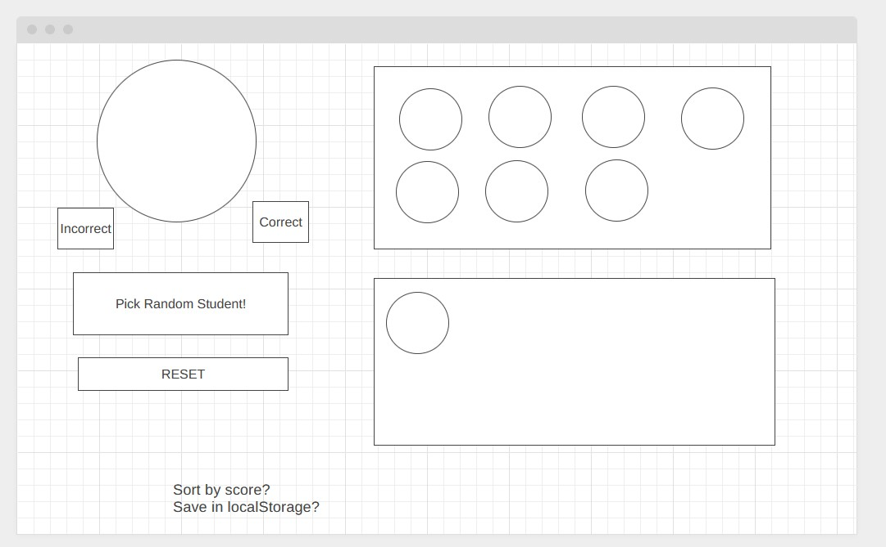

# NU Hotseat App
Pick a random student so I don't have to :D

## Develop
1. Open folder in terminal
2. Run `npx http-server`

## User Story
As an Instructor
I want a random student picker
so that i don't need to think about calling on students

## Potential Features
* I dont want to manually keep track of a list of students - Slack API to provide data
* Keep track of who answered correctly
* keep track of points
* reset
* Tinder-style UI for correct or incorrect
  ** buttons
  ** swipe
  ** keypress 

## Wireframe

